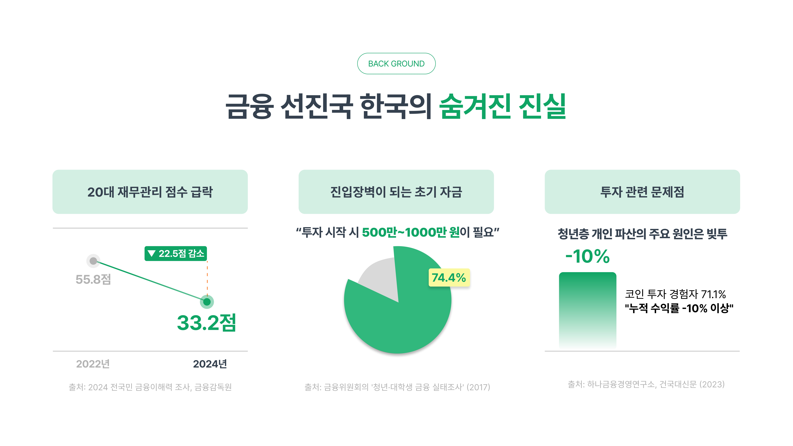
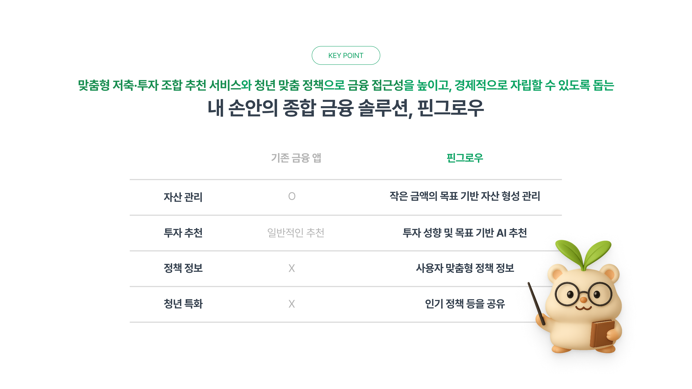
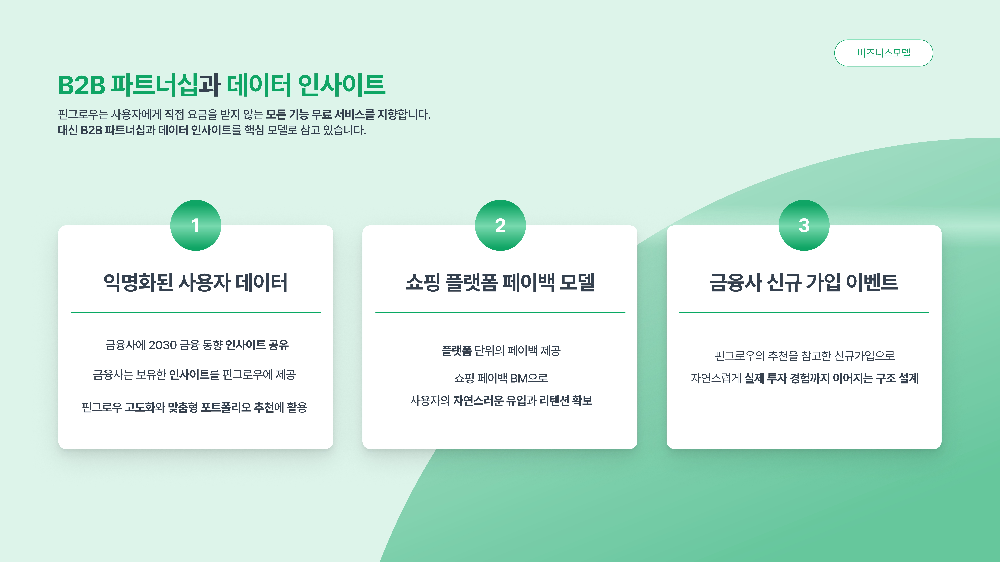
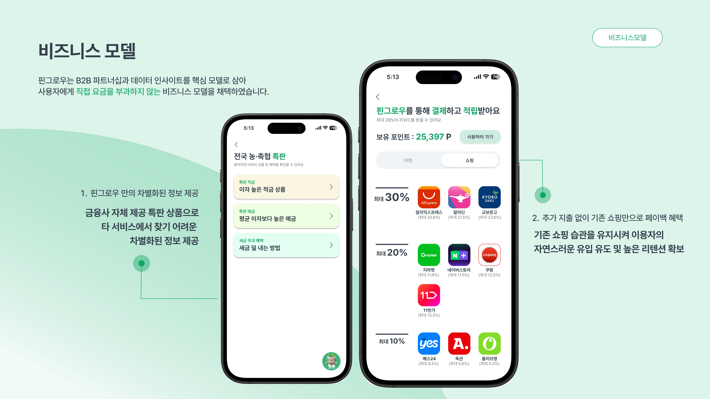
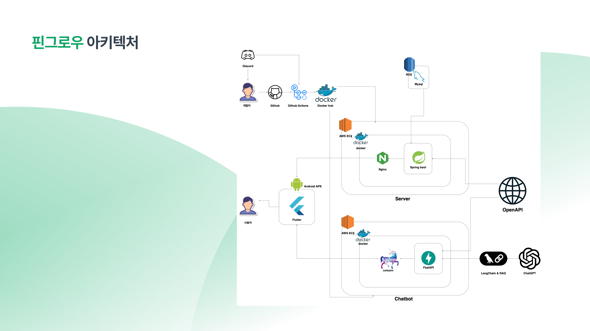

# [2025 kakao X 9oorm 시즌톤] 55팀 핀그로우(PinGrow)

[핀그로우(PinGrow) FE 레포지토리 바로가기](https://github.com/9oormthon-univ/2025_SEASONTHON_TEAM_55_FE)
<br/>
[핀그로우(PinGrow) BE 레포지토리 바로가기](https://github.com/9oormthon-univ/2025_SEASONTHON_TEAM_55_BE)

## 당신의 미래를 키우는 작은 씨앗, 핀그로우(PinGrow) 🌱

> "Pin + Grow = 청년들의 금융 지식을 키우는 작은 씨앗"









## 핀그로우 아키텍처



## 프로젝트 구조

```
ai-financial-policy-platform/
├── api/                                 # 메인 API 모듈
│   ├── __pycache__/                     # Python 캐시
│   ├── chatbot/                         # 경제용어 챗봇 모듈
│   ├── common/                          # 공통 유틸리티
│   ├── portfolio/                       # 포트폴리오 추천 모듈
│   ├── youth_policy/                    # 청년정책 서비스
│   ├── __init__.py
│   └── main.py                          # 메인 API 서버
├── asset/                               # 정적 자산
├── economic_terms_faiss/                # FAISS 벡터 데이터베이스
│   ├── index.faiss                      # FAISS 인덱스 파일
│   └── index.pkl                        # 메타데이터
├── policy/                              # 청년정책 FastAPI 서비스
│   ├── addr_router.py                   # 주소 라우터
│   ├── main.py                          # FastAPI 메인
│   ├── policy_enrice_async.py           # 비동기 정책 상세조회
│   ├── rank_router.py                   # 랭킹 라우터
│   └── zip_Cd.py                        # 주소→행정구역코드 변환
├── recommend/                           # 포트폴리오 추천 시스템
│   ├── __pycache__/                     # Python 캐시
│   ├── enums.py                         # 위험성향 Enum 정의
│   ├── financial_portfolio_dataset.json # 금융상품 데이터
│   ├── recommender.py                   # GPT 기반 추천기
│   └── test_recommend.py                # 추천 시스템 테스트
├── resource/chatbot/                    # 챗봇 웹 리소스
│   ├── index.html                       # 챗봇 웹 인터페이스
│   ├── script.js                        # 프론트엔드 스크립트
│   └── style.css                        # 스타일시트
├── test/                                # 테스트 파일
│   └── test_chatbot.py                  # 챗봇 테스트
├── .dockerignore                        # Docker 제외 파일
├── .env                                 # 환경변수 (실제)
├── .gitignore                           # Git 제외 파일
├── .python-version                      # Python 버전 명시
├── create_vectorstore.py                # FAISS 벡터스토어 생성 스크립트
├── docker-compose.yml                   # Docker Compose 설정
├── Dockerfile                           # Docker 이미지 빌드
├── flask_api.py                         # Flask 통합 서버
├── ipo.pdf                              # IPO 관련 문서
├── README.md                            # 프로젝트 문서
├── requirements.txt                     # Python 패키지 목록
└── word.pdf                             # 경제금융용어 700선 원본
```

## 주요 기능

### 🤖 1. 경제금융용어 AI 챗봇 (RAG 시스템)

- 데이터소스: 한국은행 경제금융용어 700선
- 기술스택: FAISS Vector Store + OpenAI GPT-3.5-turbo + LangChain RetrievalQA
- 핵심기능: 벡터 검색 기반 정확한 경제용어 설명, 관련 용어 추천

### 📊 2. GPT 기반 맞춤형 포트폴리오 추천 시스템

- AI 모델: OpenAI GPT-4o-mini (비용 효율적)
- 추천방식: 사용자 위험성향 분석 → GPT 맞춤 자산배분 → 실제 금융상품 매칭
- 상품군: 예금, 적금, 채권, ETF (4개 자산군 균형 배분)

### 🏛️ 3. 청년정책 정보 서비스

- 데이터소스: 청년센터 공공 API
- 기술스택: FastAPI + asyncio 비동기 처리
- 핵심기능: 지역별 청년정책 검색, 실시간 인기 정책 TOP10 조회

## 기술스택

Backend

- Flask (경제용어 챗봇 + 포트폴리오)
- FastAPI (청년정책 서비스)

AI/ML

- OpenAI GPT-3.5-turbo (챗봇)
- OpenAI GPT-4o-mini (포트폴리오 추천)
- FAISS (벡터 검색)
- LangChain (RAG 파이프라인)

## 핀그로우 Team

|                                                               팀장/기획/BE                                                               |                                                                디자인/BE                                                                 |                                                                  BE/Ops                                                                  |                                                                   FE                                                                    |
| :--------------------------------------------------------------------------------------------------------------------------------------: | :--------------------------------------------------------------------------------------------------------------------------------------: | :--------------------------------------------------------------------------------------------------------------------------------------: | :-------------------------------------------------------------------------------------------------------------------------------------: |
|  |  |  |  |
|                                                                  강동주                                                                  |                                                                  김이슬                                                                  |                                                                  김민균                                                                  |                                                                 장우준                                                                  |
|                                              [@soltyspring](https://github.com/soltyspring)                                              |                                                   [@2sseul](https://github.com/2sseul)                                                   |                                                [@dirak4545](https://github.com/dirak4545)                                                |                                               [@lambda127](https://github.com/lambda127)                                                |
